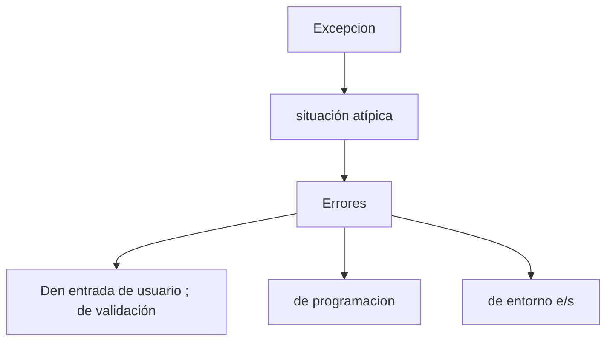
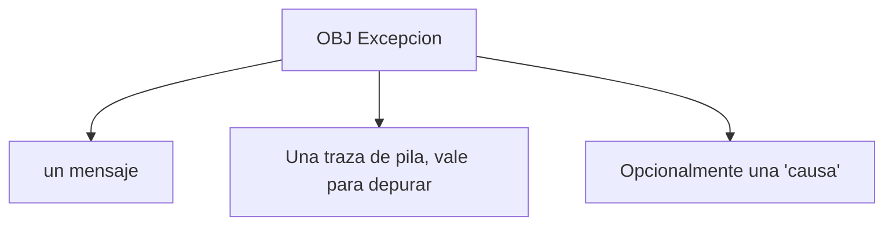
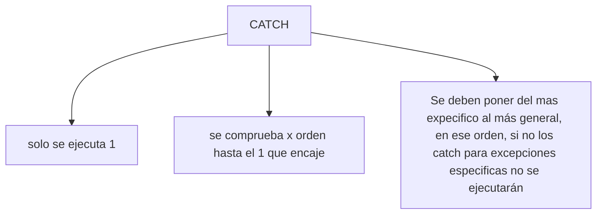
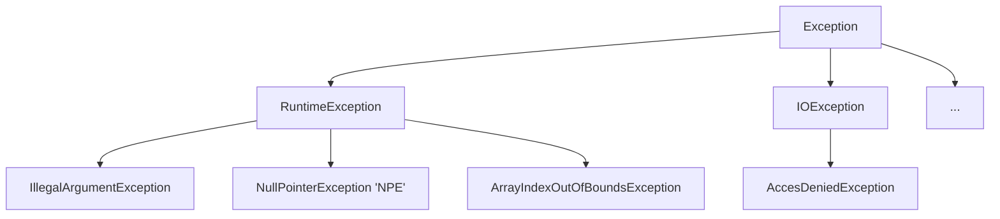

<!--
Posible prompt:
<prompt>
Tengo un cuestionario con preguntas sobre "Excepciones". Debes tener en cuenta que los conocimientos previos que tengo (y por tanto tus respuestas deben ser adaptadas), son:
- C/C++ sin orientación a objetos.
- Temas de Java previos: Clases y Objetos, Encapsulación.

Cada respuesta debe tener entre 2 - 4 párrafos de longitud (sin contar los trozos de código).

Por favor, escribe en impersonal las respuestas.

</prompt>
----
-->
# TEMA 3. Excepciones

## 1. Empecemos un tema sobre control de errores en lenguajes de programación, con algo básico. En C, donde no existen las excepciones, pongamos un ejemplo de una raíz que toma número flotante positivo. Queremos controlar el error si la función recibe un número negativo. El usuario debe ser informado pero desde fuera de la función `raiz` ¿Cómo indicamos ese error?. Enumera dos opciones diferentes de diseñar, poniendo un ejemplo de código de cada una.

### Respuesta
Una forma clásica en C, al no existir excepciones, consiste en **separar el cálculo del canal de señalización de error**. La función `raiz` puede devolver el resultado por valor y exponer un **parámetro de salida** que indique si la operación fue correcta. Así, la función no imprime nada ni decide cómo informar: solo valida el dato y marca el estado. Quien llama comprueba ese indicador y, si hay error, **informa al usuario desde fuera** (por consola, log, GUI…). Este patrón es explícito, no usa globales y mantiene la función reutilizable.

```c
#include <stdio.h>
#include <stdbool.h>
#include <math.h>

double raiz(double x, bool *ok) {
    if (ok) *ok = false;        // estado por defecto: fallo
    if (x < 0.0) return 0.0;    // valor ignorado si ok=false
    if (ok) *ok = true;
    return sqrt(x);
}

int main(void) {
    double x = -9.0;
    bool ok;
    double r = raiz(x, &ok);
    if (!ok) {
        printf("Error: argumento negativo en raiz().\n");
    } else {
        printf("Resultado: %.3f\n", r);
    }
    return 0;
}
```

Otra opción es **seguir la convención de la biblioteca estándar** y emplear `errno` para señalar errores, devolviendo además un valor especial en punto flotante como `NAN`. En este diseño, la función `raiz` establece `errno = EDOM` (dominio inválido) si la entrada es negativa y retorna `NAN`. Quien llama se encarga de consultar `errno` y/o comprobar si el resultado es `NAN` para decidir cómo notificar al usuario. Esta solución evita parámetros adicionales, pero depende de un **estado global** que conviene limpiar y leer cuidadosamente alrededor de la llamada.

```c
#include <stdio.h>
#include <math.h>    // sqrt, NAN, isnan
#include <errno.h>   // errno, EDOM

double raiz(double x) {
    if (x < 0.0) {
        errno = EDOM;     // dominio matemático inválido
        return NAN;       // no es un número válido
    }
    errno = 0;            // útil: limpiar en caso de éxito
    return sqrt(x);
}

int main(void) {
    errno = 0;            // limpiar antes de llamar
    double x = -9.0;
    double r = raiz(x);
    if (errno == EDOM || isnan(r)) {
        printf("Error: argumento negativo en raiz().\n");
    } else {
        printf("Resultado: %.3f\n", r);
    }
    return 0;
}
```

Ambos enfoques cumplen el requisito: **la función no informa** (no imprime) y la **notificación al usuario se realiza desde fuera**. La primera alternativa es más explícita y local (no depende de globales), mientras que la segunda replica las prácticas de la librería C y puede integrarse bien con otras funciones que ya usan `errno`. En proyectos mayores, también es común devolver un **código de error** (`int` o `enum`) y pasar el resultado por puntero, o encapsular ambos (resultado y estado) en una **estructura** para mayor claridad.

**CLASE:_____**
A-Devolver valor "especial"
```java
float raiz(float num){
    if(num<0.0){
        return -1.0;
    }
    return sqtr(num);
}

main(){
    float num=  PeorTeclado();
    float resultado= raiz(num);
    if(resultado!=-1.0){
        cout<<"Raiz"<<resultado;>>
        
    }else{
        cout<<"No se puede calcular";
    }

}
```

B-Pasar un parámetro por referencia para devolver el error allí
```java
float raiz(float num, int * error){
    if(num<0.0>){
        *error-01; //error
        return -1.0;
    }else{
        *error =0 //todo OK
        return sqtr(num);
    }
}
```


## 2. Brevemente ¿Qué es una **"excepción"**? ¿Con qué objetivo las usa un programador cuando implementa funciones o cuando las llama?

### Respuesta
Una excepción es un **mecanismo que permite señalar que ha ocurrido un error o una situación anómala durante la ejecución de un programa**. En lugar de devolver códigos de error o valores especiales, una excepción “interrumpe” el flujo normal del programa y lo desvía hacia un bloque preparado para manejar ese problema. De este modo, el error no se ignora ni queda mezclado con el resultado correcto de la función, sino que se comunica de forma clara y estructurada.

El objetivo principal al usarlas al **implementar funciones** es disponer de una forma sencilla y ordenada de indicar que algo ha fallado sin tener que devolver valores que mezclen resultado y error. Gracias a las excepciones, una función puede concentrarse en su tarea principal y lanzar una señal cuando algo no se puede completar correctamente, como recibir un dato inválido o no poder acceder a un recurso.

Por otro lado, cuando una función es **llamada**, las excepciones permiten que el código que realiza la llamada decida cómo reaccionar según convenga en ese contexto. El programador puede colocar bloques `try` y `catch` que capturen solo los errores que le interesan tratar, dejando que otros sigan su camino. Esto proporciona un control muy flexible del flujo del programa, permitiendo informar al usuario, repetir una operación o finalizar la ejecución con seguridad.

Finalmente, el uso de excepciones favorece una **separación clara entre la lógica normal y la lógica de tratamiento de errores**, lo que facilita la lectura, el mantenimiento y la robustez del programa. En lenguajes como Java, donde las excepciones forman parte esencial del diseño, permiten gestionar errores de manera ordenada y coherente, muy superior a las técnicas tradicionales de C basadas en códigos de retorno o variables globales.


**CLASE:_____**

Al implementar una función , puedo lanzarlas
-Al llmar a funciones puedo capturarlas

```java
class Calculadora{
    static float raiz(float num){
        if(num<0.0){
            throw new IntegralArgumentException("num negativo")
            //se termina la funcion raiz
        }
        return Math.sqtr(num);
    }
}
.
.
.
class App{
    ...main(...){
        float num=leerDeTeclado();
        try{
            float resultado= Calculadora.raiz(num);
            sout("Raiz: " + resultado)
        } catch(IlegalArgumentException  e ){
            sout("no se pudo calcular");
        }
        
    }
}
```

## 3. Reescribe el mismo ejemplo de raiz, pero en Java, metiendo ese método en una clase `Calculadora` y llama a dicho método desde el método `main`, mostrando cómo se puede controlar desde fuera.

### Respuesta
Una forma idiomática en Java consiste en validar la precondición dentro de `Calculadora.raiz(double)` y **lanzar una excepción** si el argumento no cumple (número negativo). Así, el método queda limpio y centrado en su tarea (calcular la raíz cuando procede) y no decide cómo informar al usuario. La **responsabilidad de informar** se traslada al código que llama, que captura la excepción en un bloque `try-catch` y muestra el mensaje apropiado. Este enfoque separa claramente la lógica normal de la de errores y encaja con lo ya visto de clases/objetos y encapsulación.

```java
// Clase con la lógica de negocio
class Calculadora {
    // Método "público" que valida y calcula
    public static double raiz(double x) {
        if (x < 0) {
            // Señaliza el error: dato inválido para la operación
            throw new IllegalArgumentException("La raíz solo acepta números no negativos. Recibido: " + x);
        }
        return Math.sqrt(x);
    }
}

// Punto de entrada: controla el error "desde fuera"
public class App {
    public static void main(String[] args) {
        double x1 = 9.0;
        double x2 = -9.0;

        // Caso correcto
        try {
            double r1 = Calculadora.raiz(x1);
            System.out.println("Resultado: " + r1);
        } catch (IllegalArgumentException e) {
            // Aquí se decide cómo informar al usuario
            System.out.println("Error al calcular la raíz: " + e.getMessage());
        }

        // Caso que produce error
        try {
            double r2 = Calculadora.raiz(x2);
            System.out.println("Resultado: " + r2);
        } catch (IllegalArgumentException e) {
            System.out.println("Error al calcular la raíz: " + e.getMessage());
        }
    }
}
```

En este diseño, `Calculadora.raiz` **no imprime** ni interactúa con el usuario: solo valida y, si es necesario, **lanza** `IllegalArgumentException`. El método `main` es quien **controla desde fuera** con `try-catch`, decide el mensaje y mantiene la aplicación en un estado coherente. Si se prefiriese diferenciar tipos de error, puede definirse una excepción propia (por ejemplo, `ArgumentoNegativoException`) y capturarla de forma específica; para un ejemplo simple, `IllegalArgumentException` resulta suficiente y claro.


## 4. ¿Qué es **"lanzar"** una excepción? ¿Qué es **"controlar"** o **"capturar"** una excepción? ¿Qué es que se **"propague"** una excepción? ¿Qué le va ocurriendo a las funciones en la pila de llamadas por donde se va propagando la excepción? ¿Las funciones que no la controlan se reanudan después de alguna forma? Explica con el mismo ejemplo anterior en Java de la raíz cuadrada.

### Respuesta
“Lanzar” una excepción significa **interrumpir la ejecución normal de un método** cuando se detecta una situación incorrecta, y crear un objeto de tipo excepción que será enviado hacia el exterior. En el ejemplo de la raíz cuadrada, `Calculadora.raiz(x)` lanza (`throw`) una `IllegalArgumentException` cuando recibe un número negativo. En ese momento, el método deja de ejecutar sus líneas restantes y la excepción empieza a buscar un lugar donde pueda ser tratada.

“Controlar” o “capturar” una excepción consiste en **interceptarla dentro de un bloque `try-catch`** para manejarla de forma adecuada. El código que llama al método decide qué hacer: mostrar un mensaje, repetir la operación o finalizar la ejecución. En `main`, el bloque `try-catch` que envuelve la llamada a `Calculadora.raiz(x)` es el responsable de capturar la excepción y presentar el error al usuario, sin que la aplicación se bloquee inesperadamente.

Decir que una excepción “se propaga” significa que, si un método no la captura, **la excepción continúa subiendo por la pila de llamadas**. Cada función que no la controla se detiene inmediatamente, no vuelve a reanudarse y abandona lo que estuviera haciendo. La pila se va “desmontando”: primero termina `raiz`, luego el método que llamó a `raiz`, y así sucesivamente, hasta encontrar un `catch` adecuado o llegar al método `main`.

Las funciones que no controlan la excepción **no se retoman nunca**. Su ejecución termina en el instante en que la excepción pasa por ellas. En el ejemplo, si `main` no tuviera bloque `try-catch`, la excepción continuaría propagándose y el programa terminaría mostrando un error. En cambio, como sí la captura, `main` puede mostrar un mensaje como “Error al calcular la raíz” y continuar ejecutando otras partes del programa después de manejar la excepción.


## 5. ¿Qué ventajas tiene frente a C, la **"propagación natural"** de las excepciones a través de la pila (*stack*) de llamadas?

### Respuesta
La propagación natural de excepciones aporta una gran ventaja respecto a C porque **permite separar completamente la lógica del programa de la gestión de errores**. En lenguajes como C, cada función debe comprobar manualmente si la anterior ha fallado, lo que obliga a mezclar continuamente código de cálculo con comprobaciones de error, dificultando la lectura y aumentando el riesgo de olvidar alguna validación. Con la propagación automática, un método simplemente lanza la excepción y no tiene que preocuparse de quién la capturará ni de cómo se gestionará, manteniendo así el código mucho más limpio.

Otra ventaja importante es que **la pila de llamadas se desmonta de manera ordenada y segura**. En C, si ocurre un error, es habitual tener que devolver códigos especiales y esperar que todas las funciones intermedias gestionen correctamente ese valor. En cambio, con excepciones, cada función que no controla el error se termina inmediatamente y se libera su espacio en la pila, garantizando que el programa no continúe en un estado inconsistente. Esta limpieza automática evita errores muy comunes en C, como continuar ejecutando con datos no válidos.

Además, la propagación permite que **el error llegue directamente al punto donde tenga sentido tratarlo**, en lugar de obligar a todas las funciones intermedias a participar en la gestión. Así, el programador puede decidir si quiere manejar el error cerca del cálculo o en capas más externas del programa, como la interfaz de usuario o un módulo de registro. Esto facilita crear programas robustos, donde cada parte se ocupa solo de lo que realmente le concierne.

Finalmente, esta estrategia reduce la duplicación de comprobaciones y simplifica la arquitectura del software. En el ejemplo de la raíz cuadrada en Java, solo `raiz()` comprueba el valor negativo y lanza la excepción; ninguna otra función debe saber cómo detectar ese error. El método `main` la captura y actúa. En C, en cambio, habría que transmitir códigos de error manualmente por todas las capas, complicando la estructura y aumentando la probabilidad de fallos.


## 6. En orientación a objetos, ¿las excepciones suelen ser objetos? ¿Qué ventajas tiene esto en términos de encapsulación? ¿Podemos entonces crear excepciones personalizadas?

### Respuesta
En orientación a objetos, las excepciones **sí suelen ser objetos**, porque contienen información relacionada con el error ocurrido. En Java, todas las excepciones derivan de la clase `Throwable`, por lo que cada tipo de excepción puede almacenar mensajes, causas internas y otros datos útiles. Al ser objetos, permiten tratar el error como una entidad completa y estructurada, no solo como un número o un código suelto. Esto aporta claridad y hace posible transmitir información precisa sobre qué falló y por qué.

Desde el punto de vista de la **encapsulación**, usar objetos como excepciones permite agrupar dentro de ellos todo lo que pertenece al error: su descripción, su causa interna, métodos auxiliares, etc. El código que lanza la excepción no necesita saber cómo se mostrará o qué acciones se tomarán; solo crea el objeto y lo lanza. Por su parte, el código que la captura puede decidir qué partes de ese objeto necesita para manejar la situación. Esta separación de responsabilidades es coherente con los principios de la programación orientada a objetos.

Además, como las excepciones son clases, es posible **crear excepciones personalizadas**. Esto permite representar errores específicos del dominio del programa, diferenciándolos claramente de otros más generales. Por ejemplo, en el caso de la raíz cuadrada, puede definirse una excepción llamada `NumeroNegativoException` que represente exactamente ese tipo de fallo. De este modo, quien capture la excepción puede identificarla con precisión y actuar en consecuencia, sin confundirse con otras excepciones de tipo genérico.

En conjunto, el uso de excepciones como objetos proporciona un mecanismo potente y expresivo para gestionar errores. Permite enriquecer la información que viaja con la excepción, separar responsabilidades entre quien lanza y quien captura, y diseñar jerarquías completas de errores adaptadas a las necesidades del programa. Estas capacidades hacen que el tratamiento de errores en lenguajes orientados a objetos sea más claro, robusto y mantenible.


## 7. En relación con las ventajas de la encapsulación, comparando el ejemplo en C con Java. ¿Qué **información esencial** lleva cualquier **objeto excepción** que es muy útil tener cuando se llega a un manejador?

### Respuesta
En cualquier lenguaje orientado a objetos como Java, un objeto excepción **siempre transporta información esencial** que resulta muy útil cuando finalmente llega a un manejador (`catch`). Esta información está encapsulada dentro del propio objeto, lo que permite tratar el error de forma más clara y estructurada que en C. En particular, una excepción incluye siempre **un mensaje descriptivo**, que explica qué ha ocurrido y por qué se ha lanzado. Esto es muy útil para que el manejador pueda informar al usuario o registrar el error sin tener que adivinar su causa ni reconstruirla a partir del contexto.

Además del mensaje, una excepción contiene la **traza de la pila (stack trace)**, que es la lista de métodos por los que fue pasando la ejecución hasta que ocurrió el problema. Esta traza resulta extremadamente valiosa para depurar, ya que permite conocer no solo el método donde se lanzó la excepción, sino también todos los métodos que llevaron hasta ese punto. En C esta información debe reconstruirse manualmente o no está disponible, mientras que en Java viene de forma automática gracias a que cada excepción es un objeto completo que encapsula su propio contexto.

Otro aspecto fundamental es que una excepción puede incluir una **“causa” interna**, es decir, otra excepción que provocó la actual. Esto permite encadenar errores de distintas capas del programa (por ejemplo, un error de lectura de fichero que termina derivando en un error de cálculo). El programador puede así preservar toda la información relevante sin perder detalles por el camino, algo que en C resulta mucho más complicado de gestionar sin estructuras auxiliares y comprobaciones manuales.

En conjunto, esta información encapsulada —mensaje, traza de pila y posible causa— permite que el manejador tenga acceso inmediato a **todo lo necesario para reaccionar adecuadamente**, ya sea mostrando un mensaje claro, registrando el problema o tomando decisiones sobre cómo continuar. Esta riqueza informativa hace que el tratamiento de errores en Java sea considerablemente más robusto y cómodo que en C.

**CLASE:___**




## 8. En Java, sobre el bloque **"try-catch"**, ¿se pueden tener más de un bloque `catch`? ¿cuántos bloques `catch` se ejecutan?

### Respuesta
Sí, en Java es posible tener **más de un bloque `catch`** asociado a un mismo `try`. Cada bloque `catch` sirve para **capturar un tipo distinto de excepción**, permitiendo así reaccionar de manera diferente según el error que ocurra. Esto encaja con la idea de que las excepciones son objetos y pueden pertenecer a clases distintas dentro de una jerarquía. Por tanto, un conjunto de varios `catch` permite un tratamiento más fino y especializado, sin mezclar distintos tipos de errores en un único bloque.

En cuanto a cuántos `catch` se ejecutan, **solo se ejecuta uno**: el **primero cuya clase coincida** con el tipo de la excepción lanzada o con una de sus superclases. En cuanto se encuentra un `catch` compatible, ese bloque se ejecuta y los demás se ignoran por completo. Esto garantiza que cada excepción se maneje de forma coherente y que el flujo del programa no pase por varios manejadores para un mismo error, evitando duplicaciones o acciones contradictorias.

Es importante recordar que los bloques `catch` deben ordenarse desde las **excepciones más específicas** hacia las **más generales**. Si se coloca primero un `catch` muy general (como `Exception`), impediría que los `catch` específicos fueran alcanzados nunca, ya que la excepción coincidiría antes con el tipo general. Esta regla de orden responde a la jerarquía de clases y mantiene el control del flujo de errores bien estructurado.

En resumen, un `try` puede tener tantos `catch` como se necesiten, pero solo uno se ejecutará por excepción. Esta capacidad permite manejar de forma precisa distintos tipos de fallos, manteniendo el código más claro y respetando la lógica de la programación orientada a objetos.

**CLASE:___**
Si, se pude tener más de uno

```java
try{

}catch(Tipoexcepcion e){  // ej AcessDeniedException-->tipo de IOException

}catch(TipoExcepcion e2){ //IOException

}
```




## 9. Si las excepciones producen rupturas en el código llamador, ¿cómo podemos garantizar que se ejecuta siempre finalmente un código necesario para cierre de ficheros, liberacion de recursos, antes de que continúe propagándose la excepción? Pon un ejemplo en Java con `finally`, tanto con `catch` como sin él.

### Respuesta
La forma estándar en Java de **garantizar la liberación de recursos** (cerrar ficheros, conexiones, etc.) aunque haya excepciones es usar el bloque `finally`. El código dentro de `finally` **se ejecuta siempre** tras el `try` (y, si existe, tras el `catch`), tanto si hubo excepción como si no, y también si la excepción sigue **propagándose** porque no se capturó. Esto permite aislar la lógica de limpieza del resultado del cálculo y de los errores, asegurando que el programa no quede con recursos abiertos.

A continuación se muestra un ejemplo **con `catch`**: el `catch` maneja el error (por ejemplo, informando al usuario), mientras que `finally` cierra el recurso pase lo que pase.

```java
import java.io.BufferedReader;
import java.io.FileReader;
import java.io.IOException;

class Calculadora {
    public static double raiz(double x) {
        if (x < 0) throw new IllegalArgumentException("No se admiten negativos: " + x);
        return Math.sqrt(x);
    }
}

public class AppConCatch {
    public static void main(String[] args) {
        BufferedReader br = null;
        try {
            br = new BufferedReader(new FileReader("datos.txt"));
            String linea = br.readLine();              // imaginemos que contiene un número
            double x = Double.parseDouble(linea);
            double r = Calculadora.raiz(x);            // puede lanzar IllegalArgumentException
            System.out.println("Resultado: " + r);
        } catch (IllegalArgumentException | IOException e) {
            // Aquí se informa del problema al usuario / log
            System.out.println("Error: " + e.getMessage());
        } finally {
            // Se ejecuta SIEMPRE: éxito, fallo capturado o incluso return anticipado
            if (br != null) {
                try { br.close(); } catch (IOException ignored) { }
            }
            System.out.println("Limpieza completada (finally).");
        }
    }
}
```

En el siguiente ejemplo **sin `catch`**, el método no maneja la excepción; la deja **propagarse**. Aun así, el bloque `finally` se ejecuta y garantiza la liberación del recurso antes de que la excepción suba a la capa superior. Este patrón es útil cuando el tratamiento del error corresponde a otra capa (por ejemplo, la UI) pero la limpieza debe hacerse localmente.

```java
import java.io.BufferedReader;
import java.io.FileReader;
import java.io.IOException;

class Servicio {
    public static double leeYCalculaRaiz(String ruta) throws IOException {
        BufferedReader br = null;
        try {
            br = new BufferedReader(new FileReader(ruta));
            double x = Double.parseDouble(br.readLine());
            return Calculadora.raiz(x); // puede lanzar IllegalArgumentException
        } finally {
            // Se ejecuta aunque IllegalArgumentException no se capture aquí
            if (br != null) {
                try { br.close(); } catch (IOException ignored) { }
            }
        }
    }
}

public class AppSinCatch {
    public static void main(String[] args) {
        // Aquí decidimos manejar o dejar que la excepción termine el programa
        try {
            double r = Servicio.leeYCalculaRaiz("datos.txt");
            System.out.println("Resultado: " + r);
        } catch (Exception e) {
            System.out.println("Error en nivel superior: " + e.getMessage());
        }
    }
}
```

> Nota: en Java moderno, para recursos que implementan `AutoCloseable`, conviene preferir **try-with-resources** (`try (BufferedReader br = ...) { ... }`) porque cierra automáticamente sin necesidad de `finally`. Sin embargo, el objetivo aquí era mostrar explícitamente el papel de `finally` **con y sin `catch`**.


**CLASE:___**

```java
try{

}catch(){

}catch(){

}finally{ // Se ejecuta simpre que se entre en el bloque try

}
```


## 10. En Java, el bloque `finally` puede ir sin `catch`? ¿Se ejecuta siempre tanto si ocurre como si no ocurre una excepción? ¿Y si hay un `return` en medio del `try`?

### Respuesta
Sí, en Java el bloque `finally` **puede existir sin necesidad de un bloque `catch`**. Es perfectamente válido escribir un `try` seguido directamente de un `finally`. Esta forma se usa cuando no se desea capturar la excepción en ese punto, pero sí es necesario ejecutar siempre un código de limpieza antes de que la excepción continúe propagándose. De esta manera, el método puede dejar que el error suba a niveles superiores mientras garantiza que los recursos se cierren correctamente.

El bloque `finally` **se ejecuta siempre**, tanto si ocurre una excepción como si no ocurre. Da igual que el `try` termine normalmente, que lance una excepción que sea capturada o incluso que la deje sin capturar para que se propague. La función está obligada a pasar por el `finally` antes de salir del bloque, lo que asegura una ejecución predecible del código de limpieza. Esto permite liberar recursos, cerrar ficheros o restablecer estados internos sin depender del flujo normal del programa.

Incluso si hay un **`return` dentro del `try`**, el bloque `finally` se ejecuta antes de que el método devuelva su valor. El `return` queda “en pausa” mientras el `finally` realiza su trabajo, y solo después se completa la salida del método. Esto protege al programa de fugas de recursos o estados inconsistentes cuando una función termina de forma anticipada por un `return` colocado a mitad del cálculo.

Por ejemplo:

```java
public static int ejemplo() {
    try {
        System.out.println("Dentro de try");
        return 1;                       // El método quiere salir aquí
    } finally {
        System.out.println("Dentro de finally"); // Pero primero se ejecuta esto
    }
}

public static void main(String[] args) {
    System.out.println("Resultado: " + ejemplo());
}
```

La salida será:

    Dentro de try
    Dentro de finally
    Resultado: 1

Este comportamiento demuestra que `finally` es una garantía sólida: **siempre se ejecuta**, haya o no haya excepción, y exista o no un `return` anticipado dentro del `try`.

**CLASE:___**
Si, puede ir sin catch:
-Se ejecuta puesto que es finaly
-Si hubo excepcion, como no tomemos catch, se propaga


## 11. En Java, qué son las excepciones **"controladas"** y las **"no controladas"**? ¿Qué papel juega `RuntimeException`? Pon un ejemplo de excepciones típicas controladas y no controladas que incluso nosotros mismos podríamos usar. Haz dos listas con 3 o 4 ejemplos de situación donde se suele preferir una excepción controlada y donde se suele preferir una excepción no controlada.

### Respuesta
En Java, las excepciones **controladas** (checked) son aquellas que **el compilador obliga a manejar** explícitamente mediante `try-catch` o declarando `throws` en la cabecera del método. Representan situaciones esperables y externas al programa, como que un fichero no exista o una operación de entrada/salida falle. Por otro lado, las excepciones **no controladas** (unchecked) son aquellas que **no requieren ser capturadas ni declaradas**, normalmente provocadas por errores de programación, como acceder fuera de un array o enviar un `null` donde no corresponde. Estas excepciones derivan de `RuntimeException`, que actúa como clase base para los fallos lógicos del programa.

`RuntimeException` desempeña el papel central en las excepciones no controladas. Cualquier excepción que herede de ella puede lanzarse sin declararla y propagarse libremente por la pila. Esto permite escribir código más limpio cuando el error corresponde realmente a un fallo del programador y no a un problema externo. Además, es posible crear excepciones personalizadas tanto controladas (heredando de `Exception`) como no controladas (heredando de `RuntimeException`), según convenga para cada situación concreta.

Algunos ejemplos típicos de excepciones **controladas** que nosotros mismos podríamos usar son `IOException`, `FileNotFoundException` o `SQLException`, que representan fallos externos previsibles. Por el contrario, ejemplos típicos de excepciones **no controladas** son `NullPointerException`, `ArrayIndexOutOfBoundsException` o `IllegalArgumentException`, que indican errores de uso o programación y no suelen requerir captura obligatoria.

A continuación se muestran dos listas de situaciones donde suele preferirse cada tipo:

**Situaciones donde se prefiere una excepción controlada (checked):**

*   Fallo al abrir un fichero que puede no existir.
*   Problemas de entrada/salida al leer datos externos.
*   Error al acceder a un recurso externo como una base de datos.
*   Operaciones en red que pueden fallar por causas ajenas al programa.

**Situaciones donde se prefiere una excepción no controlada (unchecked):**

*   Parámetros inválidos en un método (por ejemplo, número negativo en una raíz).
*   Acceso a índices no válidos en arrays o listas.
*   Operaciones con objetos que podrían ser `null`.
*   Violación de una precondición del método o error lógico del programador.

**CLASE:___**

-la RuntimeExceptions son "No controladas"; no estas obligado a poner bloques try catch/throw
-el resto son "Controladas" poner try catch/throw


## 12. ¿Qué es y para qué se usa `throws`? ¿Por qué es alternativa a capturar una excepción controlada?

### Respuesta
En Java, la palabra clave **`throws`** se utiliza en la cabecera de un método para **indicar que dicho método puede lanzar una excepción controlada (checked)** y que no se va a encargar de capturarla internamente. Con esto, el método avisa a sus llamadores de que deben estar preparados para gestionar ese error. Es, por tanto, una forma de “prometer” que cierto tipo de fallo puede ocurrir y que el código externo debe atenderlo. Esto permite mantener el método más limpio y delegar la responsabilidad del manejo de errores a un nivel superior del programa.

El uso de `throws` resulta especialmente útil en métodos que trabajan con **recursos externos**, como ficheros o redes, donde pueden producirse errores que no tiene sentido resolver dentro del propio método. En lugar de obligar al método a poner un bloque `try-catch`, se declara:  
`public void leer() throws IOException`. Con esta declaración, si ocurre el error, la excepción simplemente se propaga hacia arriba, permitiendo que otro módulo —quizá la capa de interfaz— decida qué hacer. Así, `throws` permite separar el código que realiza un cálculo del código que maneja el error, favoreciendo la claridad y la responsabilidad única.

`throws` es una **alternativa a capturar** una excepción controlada porque satisface la obligación que impone el compilador: toda excepción checked debe **o bien capturarse con `try-catch`, o bien declararse con `throws`**. No declarar ni capturar una excepción controlada provocaría un error de compilación. Usar `throws` no resuelve el error en ese mismo método, pero sí transfiere la responsabilidad, manteniendo la cadena de propagación natural de las excepciones. De este modo, `throws` permite que un método siga centrado en su tarea principal sin mezclarla con lógica adicional de manejo de errores.

En resumen, `throws` sirve para **propagar hacia arriba excepciones controladas**, dejando claro qué métodos pueden fallar y delegando la decisión de cómo actuar ante ese fallo. Es una alternativa a capturar la excepción en el mismo método y forma parte de la filosofía de Java para gestionar errores de forma ordenada, explícita y estructurada.


**CLASE:___**
```java
public String leerFichero(Path p) throws IOException{//Opcion b(throws)

}try{
    //Opcion A
    ...=Files.readAllBytes(p);
}catch(IOException){

}
```

## 13. Pon un ejemplo en Java de firma de método que incluya `throws`, de una función que abre un fichero pero que declara que no le interesa menejar la excepción de si el fichero no existe, sino que se propague hacia arriba. Eso sí, acuérdate del `finally`.

### Respuesta
Una forma correcta es declarar en la **firma del método** que puede producirse una excepción *controlada* (por ejemplo, `IOException`) y **no capturarla** dentro del método, dejando que se **propague hacia arriba**. Aun así, es imprescindible **liberar el recurso** en un `finally`. En el ejemplo, se abre un fichero, se lee su primera línea y se cierra el `BufferedReader` en `finally` aunque haya error; la excepción de E/S **no se maneja aquí**, se declara con `throws`.

```java
import java.io.BufferedReader;
import java.io.FileReader;
import java.io.IOException;

public class Ficheros {

    // Firma que delega el manejo del error al llamador:
    // este método NO captura IOException; la declara con 'throws'.
    public static String leerPrimeraLinea(String ruta) throws IOException {
        BufferedReader br = null;
        try {
            br = new BufferedReader(new FileReader(ruta));
            return br.readLine();  // puede devolver null si el fichero está vacío
        } finally {
            // Se ejecuta siempre: éxito, excepción o return anticipado
            if (br != null) {
                try { br.close(); } catch (IOException ignored) { /* se evita encadenar errores en cierre */ }
            }
        }
    }

    public static void main(String[] args) {
        try {
            String linea = leerPrimeraLinea("datos.txt");
            System.out.println("Primera línea: " + linea);
        } catch (IOException e) {
            // Aquí, en un nivel superior, se decide cómo informar al usuario
            System.out.println("No fue posible leer el fichero: " + e.getMessage());
        }
    }
}
```

Como variante moderna, puede usarse **try-with-resources** para evitar el `finally` explícito siempre que el recurso implemente `AutoCloseable`. Sin embargo, el requisito de este ejercicio es recordar el `finally`, por lo que se muestra el patrón clásico con cierre manual y `throws` para diferenciar con claridad la **limpieza local** del **manejo de errores en el llamador**.


**CLASE:___**
```java
public String leerFichero(Path p) throws IOException{//Opcion b(throws)

}try{
    //Opcion A
    ... = Files.readAllBytes(p);
}finally{
    ...
}
```


## 14. ¿Podemos poner en `throws` excepciones no controladas, como `RuntimeException`? ¿Debería el método llamador entonces poner `try-catch` en ese caso? ¿Qué sentido tendría?

### Respuesta
Sí, en Java **se puede** declarar en `throws` excepciones **no controladas** (unchecked), como `RuntimeException` o cualquiera de sus subclases. Sin embargo, **no es obligatorio** hacerlo: el compilador no exige ni capturarlas (`try-catch`) ni declararlas con `throws`. Incluir una unchecked en la firma **no cambia** el comportamiento de compilación ni de propagación; su efecto principal es **documentar** explícitamente que el método puede fallar por una determinada condición lógica (por ejemplo, `IllegalArgumentException` si el argumento no cumple una precondición).

Respecto a si el método llamador “debe” poner `try-catch` en ese caso, la respuesta es **no por obligación**, solo **si tiene una estrategia de recuperación razonable**. Las unchecked suelen representar **errores de programación** o **violaciones de contrato** (precondiciones incumplidas, estados imposibles, `null` indebido, índices fuera de rango). En esos casos, lo habitual es **no capturarlas localmente** y dejar que se **propaguen** hasta un manejador de alto nivel (por ejemplo, el bucle principal de una app, un filtro/handler en un servidor web, o un interceptor que registre y devuelva un error). Capturarlas solo tiene sentido si el llamador **puede corregir el problema** o **debe garantizar invariantes** (p. ej., registrar y continuar aislando el fallo de un subsistema).

¿Entonces qué sentido tiene declararlas en `throws`? Principalmente, **comunicar el contrato de la API** y guiar al usuario del método: “si incumples esta precondición, se lanzará `XxxRuntimeException`”. También puede ayudar a **herramientas** y a lectores a entender el flujo de errores, sin forzar `try-catch`. En resumen: se pueden poner unchecked en `throws`, pero es **opcional** y con un propósito **informativo**; el llamador **solo** debería capturarlas cuando realmente **pueda y deba** manejar la situación (p. ej., en límites de capa, para registrar, transformar o encapsular la falla), no por imposición del compilador.

**CLASE:___**
-Por poder podemos, pero el compilador no va a obligar a bloque try.catch.
-No es habitual
-A veces se pone por documentación


## 15. ¿Cuándo se recomienda usar excepciones controladas, como `IOException`, y cuándo no controladas como `IllegalArgumentException`? ¿Existen en todos los lenguajes ambas opciones? En los que sólo existe una opción, ¿cuál es la más habitual?

### Respuesta
Las **excepciones controladas** se recomiendan cuando el error procede de una **causa externa al programa** y, por tanto, es razonable que el código llamador tenga que decidir qué hacer. Este tipo de fallos no se deben a un error de programación, sino a condiciones del entorno: ficheros que no existen, problemas de red, bases de datos inaccesibles, etc. En estos casos, usar excepciones controladas obliga al programador a tratarlas o declararlas con `throws`, garantizando que el error no sea ignorado y que se gestione de forma coherente. Por eso `IOException`, `SQLException` o `FileNotFoundException` son representativas: son situaciones previsibles, ajenas al código y recuperables.

En cambio, las **excepciones no controladas** como `IllegalArgumentException`, `NullPointerException` o `IndexOutOfBoundsException` se emplean cuando el fallo es consecuencia de **un mal uso de la API o una violación de una precondición**. En esos casos no suele tener sentido obligar al programador a capturarlas, ya que normalmente no hay forma razonable de recuperarse. Se usan para indicar que la función ha recibido valores inválidos o que se ha roto un contrato interno. Lo habitual es que se propaguen libremente, porque capturarlas no soluciona el error lógico que las causó.

No todos los lenguajes distinguen entre excepciones controladas y no controladas como hace Java. De hecho, **la mayoría de lenguajes modernos solo proporcionan un tipo de excepción no controlada**, como Python, JavaScript, C#, Ruby o Kotlin. En esos lenguajes, las excepciones funcionan como las no controladas de Java: si se lanzan, el método llamador puede capturarlas, pero **no está obligado** a hacerlo y el compilador no impone restricciones. Esta opción es la más habitual porque simplifica el diseño del lenguaje y evita la necesidad de declarar `throws`.

En lenguajes donde solo existe una opción, la tendencia predominante es la de las **excepciones no controladas**, ya que permiten un estilo de programación más natural, sin obligatoriedad de capturar cada posible error. Java es una excepción notable por mantener ambas categorías, pero incluso en Java se debate desde hace años que las excepciones controladas pueden volverse demasiado verbosas cuando se abusa de ellas. En la práctica, resulta recomendable utilizarlas solo para fallos externos y razonablemente recuperables, y reservar las no controladas para los errores lógicos o de contrato.

**CLASE:___**
-Cundo son para situaciones q no podemos evitar q vuelvan a sudceder

-Cada lenguaje tine su forma de solucionar sus errores, la mayotía suele ir por las no controladas, no usar try catch, deciden q si surgen pete y poner a la segunda la excepción


## 16. ¿Tiene sentido lanzar excepciones dentro del `catch`? ¿Se puede relanzar la misma excepción capturada? ¿Cuándo tendría sentido hacer esto último? Pon ejemplos de ambos casos.

### Respuesta
Sí, tiene sentido **lanzar excepciones dentro de un `catch`**, y también es perfectamente válido **relanzar la misma excepción capturada**. Ambas situaciones aparecen en diseños reales, normalmente al estructurar capas (niveles) de un programa o al querer transformar un error en otro más apropiado. Cada caso responde a un propósito distinto y está alineado con la idea de que una excepción es un objeto que puede viajar por la pila con información contextual.

Lanzar una nueva excepción dentro de un `catch` tiene sentido cuando el código que captura la excepción **entiende el error**, pero necesita **convertirlo en otro más apropiado para su capa**. Por ejemplo, una capa baja recibe un `IOException`, lo entiende, pero en la capa superior se desea representar el problema como un error de negocio, usando una excepción propia. Este patrón permite *traducir* errores técnicos en errores semánticos que encajan mejor con la lógica del programa, sin perder la causa original.

Relanzar la **misma excepción** capturada también es válido. Esto tiene sentido cuando el objetivo del `catch` es realizar alguna acción obligatoria (como registro, auditoría o limpieza adicional) y luego **permitir que la excepción siga propagándose** porque la capa actual no sabe solucionarla. En este caso, se ejecuta código útil y luego se relanza para que otro nivel decida el tratamiento final. Este patrón respeta la propagación natural del error y mantiene la responsabilidad donde corresponde.

**Ejemplo 1: lanzar una excepción distinta dentro del `catch`** (traducción de errores):

```java
try {
    FileReader fr = new FileReader("datos.txt");
} catch (IOException e) {
    // Traducción: la capa de negocio no quiere tratar IOException directamente
    throw new RuntimeException("Error al acceder al archivo requerido.", e);
}
```

Aquí la excepción capturada se envuelve en otra más acorde con la lógica del programa. El segundo parámetro (`e`) permite encadenar la causa original.

**Ejemplo 2: relanzar la misma excepción después de hacer algo útil**

```java
try {
    double resultado = Calculadora.raiz(-5);
} catch (IllegalArgumentException e) {
    System.out.println("Registrando el error: " + e.getMessage());
    // no se puede solucionar aquí → se relanza la misma excepción
    throw e;  
}
```

En este caso, se registra el error (o cualquier otra acción necesaria) y luego se deja que la excepción **continúe subiendo**. La capa actual no es responsable de manejar el problema; solo actúa como un punto de control.

En resumen, tanto lanzar una nueva excepción dentro del `catch` como relanzar la excepción capturada son técnicas útiles y habituales. La primera se usa para traducir o encapsular el error en un tipo más adecuado para otra capa; la segunda se usa para realizar acciones adicionales antes de permitir que la excepción siga su camino natural por la pila. Ambas técnicas refuerzan la estructura y claridad del código orientado a objetos.

**CLASE:___**
-Si, tiene sentido en algunos casos
-Podemos relanzar la misma excepción:
```java
try{

}catch(NumberFormatException e){
    .
    .
    .
    throw e;  //Relanzarla

}
```
-Envolver en otra excepcion nueva: (ver 17)
```java
try{

}catch(NumberFormatException e){
    throw new RuntimeException("excepcion de E/S " , e);
}
```

-Lanzar otra excepcion nueva

```java
try{

}catch(NumberFormatException e){
    throw new AplicacionException("error"); //Sin la e
}
```

## 17. ¿En qué consiste que una excepción sea la **"causa"** de otra excepción? Pon un ejemplo en Java, donde capturemos una excepción de bajo nivel y la encapsulemos en otra personalizada de alto nivel. Cuando una excepción sale por pantalla y tiene una causa, ¿se ve?

### Respuesta
Una excepción es la **“causa”** de otra cuando un error de bajo nivel se **encapsula** dentro de una excepción de nivel superior. Esto permite conservar toda la información original (mensaje, traza, tipo de error) mientras se transforma el fallo en uno más adecuado para la capa donde se está trabajando. Es una forma de *encadenar* errores: la excepción nueva explica el problema en términos más altos, pero mantiene dentro la causa real que lo provocó. Esta técnica es común cuando se quiere traducir un error técnico en un error más semántico o específico del dominio del programa.

En Java, esta relación se establece usando el constructor de la excepción de alto nivel que acepta una **causa** (`Throwable cause`) o mediante `initCause()`. Al hacerlo, la excepción resultante queda ligada a la original, formando una cadena que se podrá ver más tarde en los logs o en la salida por pantalla. Este mecanismo facilita que las capas superiores entiendan dónde empezó realmente el problema, mejorando la depuración sin mezclar detalles técnicos en las capas donde no corresponde.

Un ejemplo práctico: se captura un error técnico de bajo nivel, como `IOException`, y se encapsula en una excepción personalizada de alto nivel, como `ErrorDeNegocioException`. La capa superior recibirá esta última, pero seguirá pudiendo ver la causa original:

```java
// Excepción personalizada de alto nivel
class ErrorDeNegocioException extends Exception {
    public ErrorDeNegocioException(String mensaje, Throwable causa) {
        super(mensaje, causa);
    }
}

public class Ejemplo {
    public static void cargarDatos() throws ErrorDeNegocioException {
        try {
            // Simula un error técnico
            throw new java.io.IOException("Fallo leyendo el fichero de configuración");
        } catch (IOException e) {
            // Se encapsula la excepción técnica en una de alto nivel
            throw new ErrorDeNegocioException("No se pudieron cargar los datos necesarios", e);
        }
    }

    public static void main(String[] args) {
        try {
            cargarDatos();
        } catch (ErrorDeNegocioException e) {
            e.printStackTrace(); // Muestra la excepción y su causa
        }
    }
}
```

Cuando esta excepción se muestra por pantalla, **sí aparece la causa**, porque Java imprime automáticamente la cadena completa de excepciones. La salida suele tener este aspecto:

    ErrorDeNegocioException: No se pudieron cargar los datos necesarios
        at Ejemplo.cargarDatos(Ejemplo.java:10)
    Caused by: java.io.IOException: Fallo leyendo el fichero de configuración
        at Ejemplo.cargarDatos(Ejemplo.java:7)

En la traza se ve claramente la excepción de alto nivel (“No se pudieron cargar los datos necesarios”) seguida por la que actuó como causa (“Fallo leyendo el fichero de configuración”). Esta visibilidad facilita enormemente localizar el origen del problema sin perder el contexto del nivel donde se detectó o manejó inicialmente.

**CLASE:___**
capturo excepcion , la meto en la excep y meto la original como causa primigenia.

---
Cousa de excepcion:
    "Excepcion externa"(NetFluxExption)
    Created by excepcion interna (IOException)

